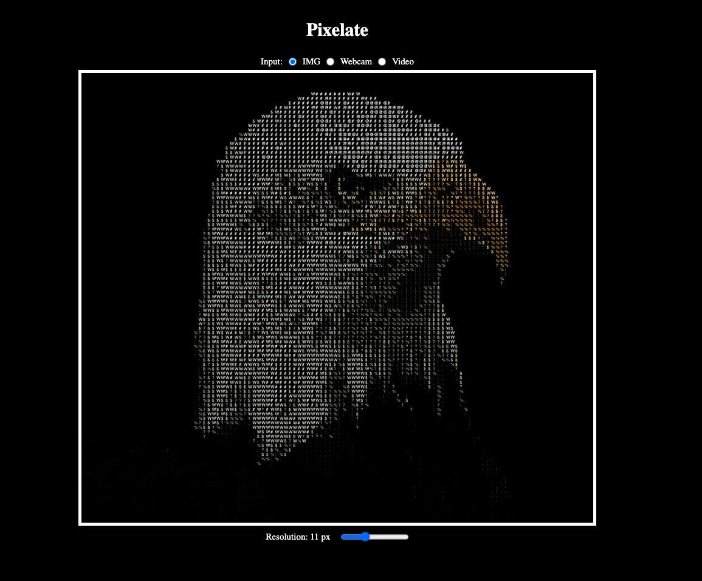

# ASCII Image Generator

This app converts an image into an ASCII character image using pure Vanilla JavaScript, allowing the user to adjust the resolution/density of ASCII characters.

This was done as an exercise and stepping stone into creating other ASCII image projects.

## Input Sources
I decided to implement a few input sources to explore and demonstrate the Ascii effect on moving and still images.
-  A default image (.png) 
-  Video (.mp4) 
-  Webcam input

## Demonstration

### Original Image

### ASCII Image

## Future implementations

In the future, I would like to explore how I can implement this ascii effect to other mediums like a FPS game (potentially using something like three.js for a demo).